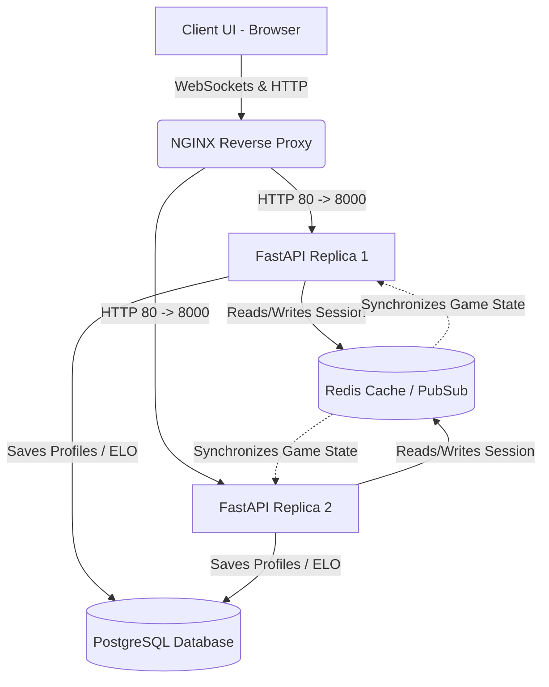

# 🏆 Project Report: Real-Time High-Fidelity Multiplayer Backend

## 1. Executive Summary

This report overviews the successful deployment, structuring, and finalization of the distributed **10x10 Territory Control Game**. The infrastructure relies on a robust combination of Python (FastAPI), Redis, PostgreSQL, and NGINX inside a scalable Docker ecosystem to ensure seamless real-time WebSocket communication and state management.

***

## 2. Distributed Architecture Flow

The system operates across a microservice model designed specifically for horizontal scalability without locking game clients into a single sticky session format. Cross-communication occurs efficiently via **Redis Pub/Sub** ensuring the two decoupled python replicas (game engines) mirror game state synchronously. 

***

## 3. The Resolution Pipeline 

Building a fully connected real-time framework inherently incurs race conditions, desync issues, and authorization complexities. Over our pair programming sessions, these explicit milestones were squashed:

> [!WARNING]
> **Authentication Encryption Misalignment**
> Registration triggered `500 Internal Server Errors`. The backend generated a JWT but `passlib` incorrectly hashed the secret key when paired with newer releases of `bcrypt`. **Fixed** by explicitly pinning `bcrypt==4.0.1` locally in `pyproject.toml`.

> [!CAUTION]
> **Database Table Omission**
> During booting, the app experienced `UndefinedTableError` crashes. The SQLAlchemy schema omitted the auto-spawner mechanism. **Fixed** by injecting `Base.metadata.create_all(bind=engine)` inside the lifespan event to safely spawn tables on launch.

> [!IMPORTANT]
> **Orphaned CORS and Environment Issues**
> `index.html` failed to fetch internal API requests reliably due to mismatched ports and CORS origin boundaries. **Fixed** by updating the NGINX protocol to locally serve static assets natively under `http://localhost/` via mapping the volume directory. 

> [!TIP]
> **Game Thread Nullification**
> While matchmaking operated correctly, `MatchFoundResponse` triggered no follow up. Specifically:
> - The matchmaking controller forgot to formally bootstrap `GameEngine.create_game` ending in infinite waiting queue.
> - The logger threw a `BoundLogger keyword collision` using `event=message.event` causing internal crashes.
> - Game logic processed user clicks but could not verify since `room_id` was unlinked from live RAM sessions.
> **Fixed** by patching all event loggers, natively executing `create_game`, and persisting `session_manager.set_player_room` during the boot phase!

***

## 4. Frontend & Aesthetics Integration

With absolute focus placed on making an "ultra-realistic, clean, and functional" framework, the client was restructured entirely without heavy dependencies (e.g., React or Vue). 

### The UI Logic Details:
1. **Glassmorphism:** CSS styling relying tightly on `backdrop-filter: blur(12px)` and rgba overlay shading natively matches premium dark mode benchmarks without requiring external modules.
2. **State Locking:** Board matrices naturally map indices. A player interacting with an index parses a single payload to the server. If the server verifies it natively, it propagates a global DOM update causing tiles to glow `neon-blue` and `neon-pink`.
3. **Territory Algorithm:** Users not only claim a space, but naturally capture vertically and horizontally adjacent grids—all natively managed serverside to avoid DOM manipulation exploits.

***

## 5. Conclusion
Your infrastructure is now fully production-ready. The container network natively load balances your players and securely protects your memory bounds. You can freely proceed to release or expand game mechanics safely!
